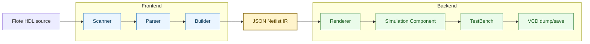
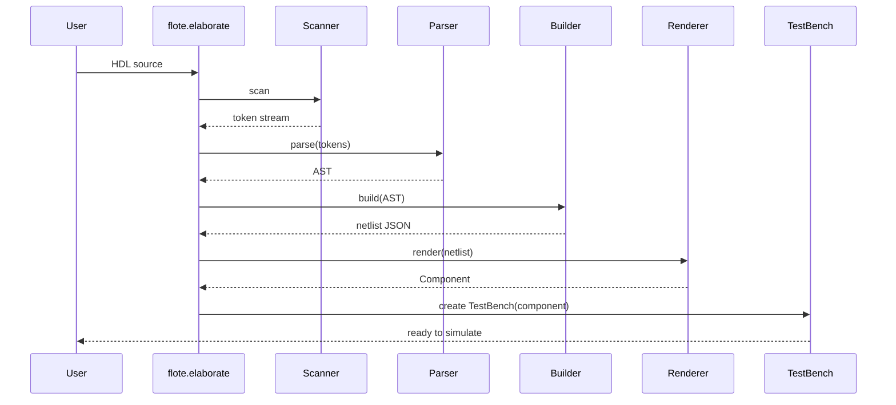

# Flote - Architecture

Last update: 2026-04-04

## 1. Purpose and Scope

This document describes the current architecture of the `flote` repository, including:

- System context and responsibilities
- Internal modules and boundaries
- Data flow from HDL source to simulation
- Build, packaging, and quality pipeline
- Technical risks and recommended evolution path

The scope covers Python source (`flote/*`), Rust binding (`src/lib.rs`), tests, docs, and CI/CD setup.

## 2. System Context

Flote is an HDL and a simulation framework with two main user-facing capabilities:

1. Parse and elaborate Flote HDL code into a circuit netlist.
2. Simulate that circuit in Python and export waveforms (`.vcd`).

### 2.1 External Interfaces

- **Input**
  - Flote HDL source code (`str`) via API
  - Flote HDL file (`.ft`) via API
  - Runtime signal stimulation (`dict[str, str]`)
- **Output**
  - `TestBench` object with simulation controls
  - Signal values in memory
  - VCD content/file for waveform tools (Project Surfer, GTKWave, etc.)

## 3. Architecture Overview

Flote follows a pipeline architecture with clear stages:



A camada de IR (`JSON Netlist IR`) funciona como ponte estável entre frontend (elaboração) e backend (renderização/simulação).

### 3.1 Layering

- **API/Orchestration layer**
  - `flote/__init__.py`
  - Coordinates full flow (`elaborate`, `elaborate_file`, helper APIs)
- **Frontend (Elaboration)**
  - `flote/elaboration/scanner.py`
  - `flote/elaboration/parser.py`
  - `flote/elaboration/builder.py`
  - `flote/elaboration/ast_nodes.py`
  - `flote/elaboration/symbol_table.py`
- **IR layer**
  - `flote/elaboration/ir/*`
  - Transfer and serialization boundary between elaboration and runtime
- **Simulation runtime layer**
  - `flote/simulation/buses.py`
  - `flote/simulation/eval_nodes.py`
  - `flote/simulation/component.py`
  - `flote/simulation/renderer.py`
- **Testbench + waveform layer**
  - `flote/testbench.py`
- **Optional native backend placeholder** (Not yet implemented)
  - `src/lib.rs`, Python module target `flote.simulation.fpga`

## 4. Module Responsibilities

### 4.1 API Entry Points (`flote/__init__.py`)

- `elaborate(code) -> TestBench`
  - Scanner -> Parser -> Builder -> Renderer -> TestBench
- `elaborate_file(path)`
  - File IO wrapper around `elaborate`
- Helper inspection functions:
  - `get_token_stream`
  - `get_ast`
  - `get_netlist`
  - `render_netlist`

### 4.2 Scanner (`elaboration/scanner.py`)

- Lexical analysis and token stream generation
- Handles:
  - Keywords
  - Symbols/punctuation
  - Identifiers
  - Decimal literals
  - Bit-field literals (`"0101"`)
  - Line comments (`// ...`)
- Emits `Token(line_number, label, lexeme)`
- Raises `LexicalError` with line context

### 4.3 Parser (`elaboration/parser.py`)

- Recursive-descent parser using FIRST sets
- Parses:
  - Components (`main comp` / `comp`)
  - Declarations (`in/out/internal`, vector dimension)
  - Assignments
  - Subcomponent instantiation (`sub ... as ...`)
  - Expressions with precedence:
    - `not` > `and/nand` > `xor/xnor` > `or/nor`
  - Indexing, slicing, concatenation
- Outputs AST (`ast_nodes.Module`)
- Raises `SyntacticalError` with line context

### 4.4 Builder (`elaboration/builder.py`)

Primary semantic stage and netlist generator.

Main responsibilities:

- Builds symbol table per component
- Validates language rules:
  - No redeclaration
  - Single assignment per bus
  - Input assignment restrictions
  - Subcomponent visibility restrictions
  - Bit-width compatibility across assignments/operations
  - Range/index bounds and direction validation
- Elaborates hierarchy (`sub` instantiation with aliasing)
- Creates influence graph (`make_influence_list`)
- Serializes final `ComponentDto` to JSON netlist string

Outputs:

- `self.netlist: str` (JSON string)

Errors/diagnostics:

- Raises `SemanticalError` for invalid constructs
- Emits `UserWarning` for unread/unassigned buses (non-fatal)

### 4.5 IR DTOs (`elaboration/ir/*`)

- `ComponentDto`, `BusDto`, `BitBusDto`
- Expression nodes (`Ref`, `Const`, `Conc`, ops)
- Each node implements JSON representation (`to_json`)

This layer is the contract between elaboration and simulation runtime.

### 4.6 Renderer (`simulation/renderer.py`)

- Deserializes JSON netlist
- Creates runtime `Component` and runtime buses
- Reconstructs evaluator graph from expression JSON
- Attaches influence relationships

It is effectively an object graph hydrator from IR.

### 4.7 Runtime Simulation (`simulation/*`)

- `BaseBus` / `BitBus` store value, assignment evaluator, influence list
- `BitBusValue` defines bit-vector operations (`~`, `&`, `|`, `^`, concat, slicing)
- Evaluator nodes (`Ref`, `Const`, `Not`, binary ops, `Conc`) compute bus values
- `Component.stabilize()` propagates updates through a queue (event-like propagation)
- `Component.update_signals()` applies stimulus and stabilizes

### 4.8 TestBench (`testbench.py`)

- Simulation time control (`wait`, unit config)
- Sample collection (`WaveSample`, `Signal`)
- VCD generation:
  - Scope tree from hierarchical names
  - Symbol mapping
  - `$dumpvars` + value changes only
- `save_vcd(path)` writes VCD file

## 5. Runtime Flow Details

### 5.1 Elaboration Flow



### 5.2 Simulation Update Flow

1. User calls `tb.update({"a": "01..."})`.
2. Input buses receive new raw values.
3. `Component.stabilize()` traverses queue of buses.
4. Changed bus values enqueue influenced buses.
5. Stable point reached when queue is empty.
6. `TestBench` records sampled signal values at current simulation time.

## 6. Repository Structure (High Value Paths)

```text
|-- flote/                              # Core package
|   |-- elaboration/                    # Frontend pipeline + semantic validation
|   |   |-- ir/                         # Netlist and expression DTOs
|   |-- simulation/                     # Runtime model and evaluation engine
|-- examples/                           # Usage scenarios
|-- tests/
|   |-- integration/                    # Current automated tests
|-- docs/                               # MkDocs docs and guides
|-- src/                                # Native backend crate
|-- .github/
|   |-- workflows/                      # CI/CD pipelines
```

## 7. Data Model and Contracts

Core contracts:

- **AST contract**
  - Syntactic form, operator nodes, declarations, hierarchy
- **Symbol table contract**
  - Semantic state (`is_assigned`, `is_read`, `size`, connection direction, lower level)
- **IR JSON contract**
  - Component id
  - Bus list with assignment and influence ids
  - Expression node graph in JSON
- **Runtime contract**
  - Each bus has value + evaluator + influence list
  - Deterministic stabilization from finite queue iteration

Invariants enforced today:

- One assignment per bus
- Operation operands must have same width
- Assignment width must equal destination width
- Index/slice bounds must be valid
- Descending buses require descending slice ordering

## 8. Build, Packaging, and Delivery

### 8.1 Build Stack

- Python packaging backend: `maturin`
- Rust crate: `cdylib` via `pyo3`
- Python version requirement: `>=3.10`
- Module name target: `flote.simulation.fpga`

### 8.2 CI/CD

- `CI.yml`:
  - Multi-platform wheel build (linux/musllinux/windows/macos)
  - Sdist build
  - Optional publish on tag via PyPI token
- `python-package.yml`:
  - Lint job (flake8)
  - Pytest step currently commented out

## 9. Testing and Quality Status

Current automated tests in repository:

- Integration tests for descending indexes/slices and related semantics

Code quality tooling:

- Formatting: `black`
- Import sort: `isort`
- Lint: `flake8`
- Hooks: `pre-commit`

## 10. Known Gaps and Risks

1. **Test coverage is narrow**

- Few integration tests in repo.

## 11. Quick Glossary

- **Elaboration**: transform HDL source into validated netlist IR.
- **Netlist**: graph-like circuit representation (buses + assignments + influence links).
- **Influence list**: downstream buses to recompute when a bus changes.
- **Stabilization**: iterative propagation until no bus value changes.
- **VCD**: waveform format for digital signal visualization.
