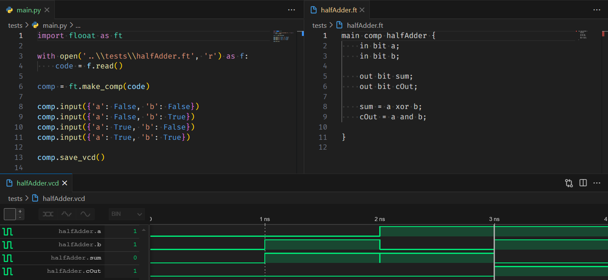

# Flote

<div align="center">
  
</div>

## Introduction

Flote is a hardware description language and Python framework for simulation. It is designed to be **friendly, simple, light and productive**. More easy to use and learn than Verilog and VHDL. Using Flote, you can create integrated circuits component by using it's HDL and/or Python framework that work by the HLS (High Level Synthesis) concept.



## Release

Flooat is in development and is not ready for production. The beta version is expected to be released in april.

## Example

Here is an example of a half adder in Flote:

```flote
comp halfAdder {
  in bit a;
  in bit b;

  out bit sum = a xor b;
  out bit carry = a and b;

}
```

## How it works

Flote's Evaluator uses a structure of a compiler's front-end to elaborate the component. It has a scanner, parser and a builder. This last one is responsible for build the component, an object that can be manipulated in Python and simulates the behavior of the integrated circuit. The model object it's a set of signals buses and uses event driven algorithm and dynamic programming to simulate the behavior of the circuit.

Using the HLS side, you can create the component by hand. Also with the use of the Python package you can manipulate the signals and sava then in a waveform file.

## To Do List

- [X] Make the simulator class
- [X] Make EBNF for the language
- [X] Make Scanner
- [X] Make Parser
- [X] Make Builder
- [X] Make accept expressions
- [X] Improve the algorithm of simulation
- [X] Improve structure
- [X] Improve declaration and assignment
- [X] Improve Semantic Analysis
- [X] Create waveform class
- [X] Add line number in semantic errors
- [ ] Add multi-bit signals support
- [ ] Add multi-bit signals addressing support
- [ ] Add sub-components support
- [ ] Add Python calls support
- [ ] Improve HLS support
- [ ] Add manual time control
- [ ] Add others file types support for waveforms
