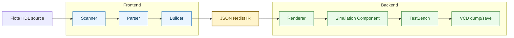

# Flote

<br>

<div align="center">
  
</div>

<br>

<div align="center">
  
  
  
  
  
</div>

## 🛸 Introduction

Flote is a hardware description language and Python framework for hardware simulation. It is designed to be **friendly, simple, light and productive**. More easy to use and learn than Verilog and VHDL. Using Flote, you can create integrated circuits component by using it's HDL and/or Python framework.

<div align="center">
  
</div>

Here is an example of a half adder in Flote:

```flote
comp HalfAdder {
  in bit a, b;

  out bit sum = a xor b;
  out bit carry = a and b;

}
```

## ⚙️ How it works

Flote's frontend (the elaborator) parses designs written in the Flote HDL and produces a netlist representing the circuit. The frontend includes a scanner, a parser and a builder, with the builder responsible for assembling the netlist. The backend converts that netlist into a simulation model - an object exposed by the Python API that replicates the integrated circuit's behavior. The simulation model is composed of signals and buses and relies on event-driven simulation combined with dynamic programming techniques to compute the circuit's temporal behavior. The Python package also supports exporting simulation data to waveform files (for example, VCD).


```mermaid
flowchart LR
  A[Flote HDL source] --> B

  subgraph FE[Frontend]
    direction LR
    B[Scanner] --> C[Parser]
    C --> D[Builder]
  end

  D --> E[JSON Netlist IR]

  subgraph BE[Backend]
    direction LR
    F[Renderer] --> G[Simulation Component]
    G --> H[TestBench]
    H --> I[VCD dump/save]
  end

  E --> F

  classDef frontend fill:#EAF5FF,stroke:#1D70B8,stroke-width:1px,color:#0B3A5B;
  classDef backend fill:#EAFBEA,stroke:#2E7D32,stroke-width:1px,color:#1B5E20;
  classDef bridge fill:#FFF4CC,stroke:#8A6D1A,stroke-width:2px,color:#5D4500;

  class B,C,D frontend;
  class F,G,H,I backend;
  class E bridge;
```

## 📚 Documentation

The documentation can be found at [flote.readthedocs.io](https://flote.readthedocs.io).

## 🎁 Buy Me a ~~Coffee~~ Beer

<div align="center">
  
</div>

If Flote helps you, consider supporting its development on [GitHub Sponsors](https://github.com/sponsors/icarogabryel) or a PIX donation to the key `icaro.gabryel@outlook.com` if you are in Brazil.

Your support helps keep the project alive and thriving!

---

<div align="center">
  <i>Flote is an open-source project developed as part of academic research at Federal University of Piauí and my humble bedroom, Brazil 🇧🇷</i>
  <br />
  <br />
  
</div>
