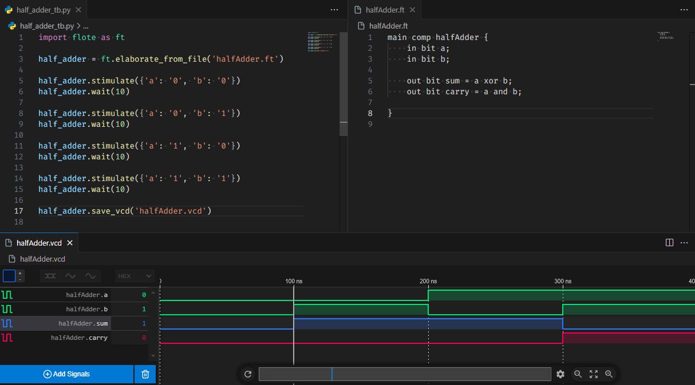

# Flooat

## Introduction

Flooat is a hardware description language, simulator and python module. It is designed to be **friendly, simple, light and productive**. More easy to use and learn than Verilog and VHDL.

## Warning

Flooat is in development and is not ready for production.

## To Do List

- Improve semantic analysis
- Make accept expressions
- Add sub-components support
- Add bit arrays support
- Make accept python calls and better HLS support
